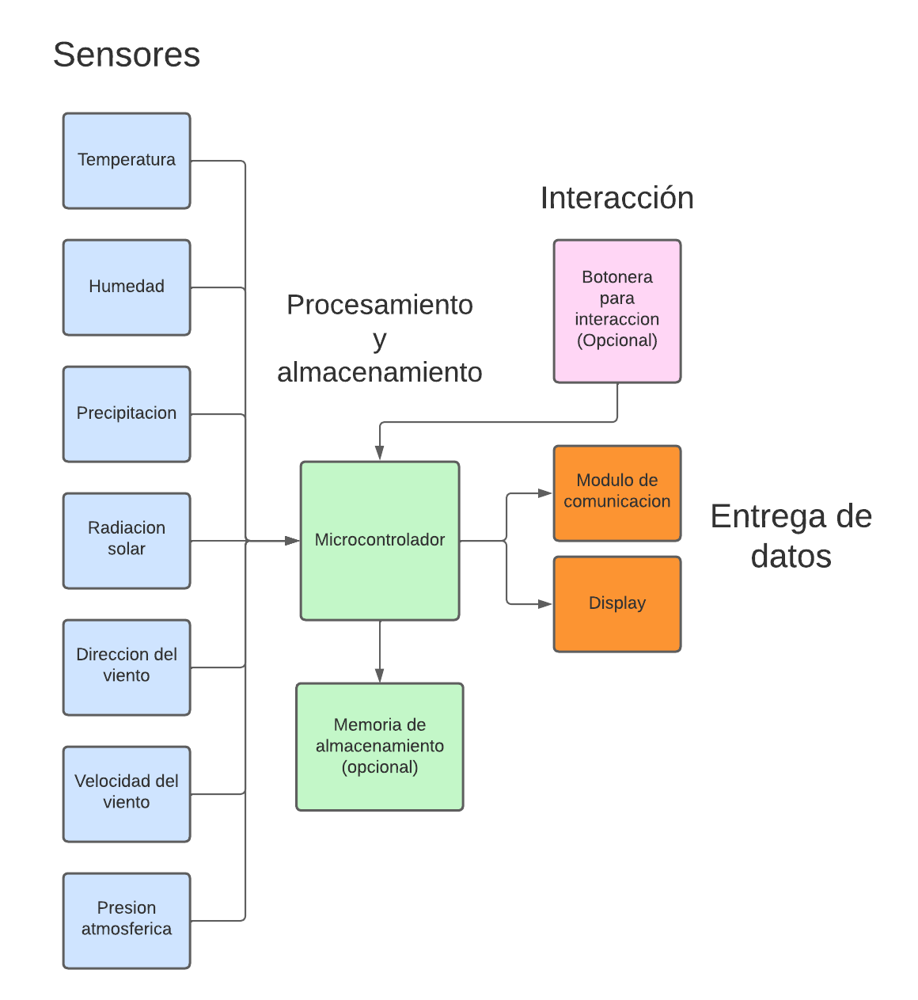

# ESCUELA TÉCNICA N°1 “Otto Krause”
## TALLER DE ELECTRÓNICA

# Informe: Estacion metereologica | Martin Sanchez || Thomas Acosta 

## Indice
---
## Descripcion del proyecto

### *Descripcion de la problematica:

- Una pequeña estación meteorológica podría solucionar diversas problemáticas relacionadas con la recopilación de datos climáticos y el monitoreo de las condiciones atmosféricas en una ubicación específica. Algunas de las problemáticas que podría abordar son:

  - Predicción del clima local

  - Alertas tempranas de fenómenos meteorológicos extremos

  - Monitoreo de la calidad del aire

  - Investigación científica local

  - Agricultura y gestión del agua

  - Eficiencia energética

  - Seguridad en el transporte

En resumen, una pequeña estación meteorológica puede solucionar problemáticas relacionadas con la falta de datos climáticos precisos y en tiempo real, y puede tener una amplia gama de aplicaciones en diversas áreas, desde la planificación diaria hasta la toma de decisiones críticas en sectores como la agricultura, la investigación científica y la seguridad.

---

### *Caracterisiticas del sistema:
- Una pequeña estación meteorológica generalmente está diseñada para recopilar datos básicos sobre las condiciones climáticas en una ubicación específica. A continuación, se presentan algunas características comunes de una pequeña estación meteorológica:

  - Sensores e instrumentos

  - Transmisión de datos

  - Registro y almacenamiento de datos

  - Alimentación energética
  
  - Durabilidad y protección

  - Interfaz de usuario

  - Conectividad y compatibilidad

- Existen varias mejoras que se podrían implementar en una pequeña estación meteorológica para ampliar su funcionalidad y precisión. Algunas de estas mejoras podrían incluir:

    - Sensores adicionales
    - Comunicación mejorada
    - Integración con sistemas de automatización

    - Interfaz de usuario avanzada

    - Integración con sistemas de alerta temprana

    - Acceso a datos históricos y almacenamiento en la nube

Estas mejoras podrían hacer que la pequeña estación meteorológica sea aún más versátil y valiosa para una variedad de aplicaciones, desde la toma de decisiones en la agricultura y la investigación científica hasta el monitoreo ambiental y la planificación urbana.

---

### *Diagrama de bloques:

- Sensores:
  - Temperatura y Humedad: Estas dos variables seran medidas por un mismo sensor en tiempo real. (Htu21d)
  - Precipitacion: Para esta variable se usara un sistema en el cual se ira midiendo la precipitacion de a 2ml, el sistema sera parecido a un "sube y baja", y cada vez que se realice un cambio de movimiento, mediante un iman acoplado a la estructura y a un sensor de efecto hall, se iran contando la cantidad de veces que esto sucede. (A3144)
  - Radiacion solar: Este sensor medira el nivel de radiacion uv en tiempo real, en base a esta medicion se mostrara, ademas del valor, la escala correspondiente de raciacion. (Guva-s12s)
  - Direccion del viento: Esta variable sera sensada con una veleta, para saber la posicion de la veleta se probara con sensores de efecto o con una serie de disco B&W pintados con distintas divisiones indicando distintas posiciones, para saber si el disco en cierta posicion es blanco o negro se usaran sensores infrarrojos. (Efecto hall: A3144) (Infrarrojo: Lm393)
  - Velocidad del viento: Esta variable sera sensada con un anemometro, la velocidad se medira por la cantidad de vueta que se den en un lapso de tiempo, se usara un sensior de efecto hall para saber cuando se dio una vuelta. (A3144)
  - Presion atmosferica: Este sensor medira la presion atmosferica en tiempo real. (BMP280)
 
- Procesamiento y almacenamiento: Todos los datos recibidos por los sensores seran procesados por el microcontrolador ESP32, y opcionalmente guardados en una unidad de almacenamiento. Estos datos seran mostrador por display y una aplicacion y/o pagina web.

- Entrega de datos: La entrega de datos que saldran, una vez procesados por el microcontrolador, seran mostrados por una pequeña pantalla OLED y por una pagina web o aplicacion, en estas dos ultimas se hara uso de la tecnologia WI-FI del micro para que sea posible la transmision de datos de manera inalambrica.

- Interaccion: Este apartado es opcional, pero se tiene pensado que mediante una botonera, el usuario, viendo en la pantalla OLED, pueda navegar entre menues para poder mas y de manera mas comoda la informacion.
---

## Listado de componentes 
### Microcontrolador

Nombre: ESP32 - Wi-Fi & Bluetooth MCU

Descripcion: 
ESP32 de 38 Pines es una placa de desarrollo que integra el microcontrolador ESP32-WROOM-32 SMD de Espressif. Esta placa permite controlar todo tipo de sensores, módulos y actuadores mediante WIFI y BLUETOOTH, para proyectos de Internet de las cosas “IoT” de forma eficiente y económica.

Especificaciones:
- Tipo: Módulo Wifi + Bluetooth
- Modelo: ESP32 38 Pines
- Voltaje de Alimentación (USB): 5V DC
- Voltaje de Entradas/Salidas: 3.3V DC
- Consumo de energía de 5μA en modo de suspensión
- CPU principal: Tensilica Xtensa 32-bit LX6
- Frecuencia de Reloj: hasta 240Mhz
- Procesador secundario: Permite hacer operaciones básica en modo de ultra bajo consumo
- Wifi: 802.11 b/g/n/e/i (802.11n @ 2.4 GHz hasta 150 Mbit/s)
- Bluetooth: 4.2 BR/EDR BLE Modo de control dual
- Memoria: 448 KByte ROM, 520 KByte SRAM, 6 KByte SRAM en RTC y QSPI admite múltiples chips flash /
SRAM
- Chip USB-Serial: CP2102
- Antena en PCB
- Pines Digitales GPIO: 24  (Algunos pines solo como entrada)
- Conversor Analógico Digital: Dos ADC de 12bits tipo SAR, soporta mediciones en hasta 18 canales, algunos pines soporta un amplificador con ganancia programable

### Sensor Intensidad Luz UV 

Nombre: Guva-s12s 

Descripcion: 
El módulo sensor de luz ultravioleta GUVA-S12SD se utiliza para detectar la intensidad de la radiación UV. El sensor tiene una salida analógica, la corriente generada por el fotodiodo S12SD es convertida por el amplificador SGM8521 en un nivel de tensión proporcional.

Especificaciones:
- Chip: GUVA-S12SD
- Tension de Alimentacion: 2.5V a 5V DC
- Tipo: Analogico
- Bajo consumo
- Alta Estabilidad
- Alta Sensibilidad
- Longitud de Onda Detectada: 240nm a 370nm
- Angulo de Apertura: 130 Grados
- Dimensiones: 11mm x 27mm

### Sensor de humedad y temperatura
Nombre: AHT10

Descripcion: 
Este sensor es muy pequeño para facilitar su utilización, ya viene integrado en un módulo que incorpora regulador de voltaje de 3.3V, cambio de nivel lógico que consta de una matriz de resistencias SMD de 10Kx4 (103) y un chip MOSFET de canal N dual de 6 pines y otros componentes SMD para complementar su funcionamiento, también este módulo tiene 4 pines, 2 para su alimentación y 2 para establecer comunicación I2C (Dirección 0x38 predeterminada) con tarjetas de desarrollo como Arduino, NodeMCU, ESP32 y otros microcontroladores.

Especificaciones: 
- Modelo: Módulo AHT10
- Tipo de interfaz: I2C (0x38)
- Voltaje de funcionamiento: 3.3V –  5V
- Rango de medición:
- Temperatura: -40°C a 85°C
- Humedad: 0% a 100% ±2 %RH
- Precisión de temperatura: ±0.3 °C
- Resolución de temperatura: 0.01 °C
- Resolución de humedad: 0.024%
- Precisión de humedad: 2%
- Dimensiones: 15.2mm x 10.6mm
- Peso: 2g

### Sensor de presion atmosferica

Nombre: BMP280

Desscripcion:
El sensor de presión barométrica BMP280 permite medir la altura respecto al nivel del mar, su funcionamiento está basado en la relación entre presión del aire y la altitud. El BMP280  es la evolución del BMP180, posee alta precisión y un bajo consumo de energía. El BMP280 ofrece un rango de medición de 300 a 1100 hPa (Hecto Pascal). Basado en tecnología BOSCH piezo-resistiva con gran robustez EMC, alta precisión y linealidad, así como con estabilidad a largo plazo. Se ha diseñado para ser conectado directamente a un microcontrolador a través de I2C o SPI. El sensor BMP280 presenta diversas mejoras respecto al sensor BMP180 como: Mejor resolución de presión y temperatura, mejor precisión, mejores filtros digitales y un menor consumo de energía.

Especificaciones:
- Voltaje de Operación: 1.8V - 3.3V DC
- Interfaz de comunicación: I2C o SPI (3.3V)
- Rango de Presión: 300 a 1100 hPa
- Resolución: 0.16 Pa
- Precisión absoluta: 1 hPa
- Rango de Temperatura: -40°C a 85°C
- Resolución de temperatura: 0.01°C
- Precisión Temperatura: 1°C
- Precisión de HR: +-3%
- Ultra-bajo consumo de energía
- Completamente calibrado
- Frecuencia de Muestreo: 157 Hz (máx.)
### Sensor efecto Hall

Nombre: A3144

Descripcion:
Sensor de efecto hall con salida digital y retención de estado. Cambia de cero a uno ante la presencia de un campo electromagnetico. En estado de reposo la salida del sensor se encuentra en nivel "Alto" y ante la presencia de un campo electromagnetico la salida pasa a nivel "Bajo".

Especificaciones:
- Voltaje de Operacion: 4.5V A 25V
- Voltaje de Operacion Tipico: 5V
- Corriente Maxima: 25mA
- Puede Detectar ambos polos de un iman
- Voltaje de salida igual al voltaje de entrada
- Proteccion de polaridad inversa
- Rango de temperatura:-40°C a 85°C
- 
### Adaptador de nivel logico 

Nombre: CJMCU 0108

Descripcion:
Convertidor de nivel lógico bidireccional, puede realizar una conexión entre dispositivos que operan a diferentes voltajes. Funciona con configuraciones de drenaje abierto y push-pull. Este traductor de 8 bits utiliza dos rieles de fuente de alimentación configurables separados. El puerto A rastrea el voltaje de suministro del pin VA (VCCA). El pin VA acepta cualquier voltaje de suministro entre 1,2 V y 3,6 V. El puerto B rastrea el voltaje de suministro del pin VB (VCCB). El pin VB acepta cualquier voltaje de suministro entre 1,65 V y 5,5 V.

Especificaciones:
- Chip: TXS0108E
- Canal: 8 canales
- Voltaje de soporte del terminal VCCA: 1,2 V-3,6 V
- Voltaje de soporte del terminal VCCB: 1,65 V-5,5 V
- Velocidad máxima de transferencia para push-pull: 110 Mbps
- Velocidad máxima de transferencia para drenaje abierto: 1,2 Mbps
- Número de pines: 20 pines
- Tamaño: 26 mm x 16 mm x 3 mm

### Pantalla OLED

Nombre: SSH1106

Descripcion:
Esta pantalla es muy pequeña (1,3 pulgadas de diagonal) pero muy visible dado su alto contraste OLED. Es una pantalla con una matriz de un color de 128x64 puntos. Dado que la pantalla está basada en la tecnología LED, no necesita retroiluminación y tiene un alto contraste incluso a plena luz del día.
El driver interno es un SH1106 que se comunica por I2C, un protocolo muy rápido ideal apra éste tipo de pantallas. Internamente todo el conjunto funciona a 3,3V pero se han acoplado tanto la alimentación como los pines de entrada para funcionar perfectamente a 5V lo que lo hace ideal para utilizar con nuestro microcontrolador favorito de 5V
Especificaciones:
- Pantalla OLED de alto contraste
- Color Emision: Azul
- Resolución: 128x64 píxeles
- Controlador Interno: SH1106
- Interfaz I2C
- Angulo de visión: >160º
- Alimentación: 3 a 5V DC
- Consumo con todos sus pixeles encendidos: 80mA
- Dimesiones: 35mm x 25mm
- Dimensiones PCB: 35.5mm x 33.7mm
- Peso: 6g
- Orden de Pines: GND,VCC
- Temepratura de funcionamiento: -30 a +70 ºC
### Bateria

Nombre: Power bank 5000 mAh

Caracteristicas:
El power bank básicamente es una batería de litio controlado por un microchip, de manera que detecta el dispositivo conectado y le suministra la corriente necesaria que admite dicho dispositivo. Dispone de circuitos de protección contra sobreintensidad y cortocircuito de manera que no tendremos que preocuparnos por si el dispositivo sufrirá daños. No obstante, se recomienda utilizar modelos certificados por el organismo de control pertinente.
El power bank cuenta como mínimo con un puerto de entrada microUSB que se utiliza para recargar el powerbank. Algunos power bank cuentan con placas solares integradas, para recargar sus baterías.
Posee al menos una salida USB para alimentar los dispositivos móviles que deseemos recargar. Puede disponer de más de una salida USB permitiendo la recarga simultánea de varios dispositivos.
- Entrada: 5V micro USB
- Salida micro USB 5V 1A
- Capacidad: 5000mAh.
- Leds indicadores.

## Desarrollo teorico y practico:

### Desarrollo teorico:
### Etapa 1: Investigacion:
Descripcion:
Durante esta etapa nos dedicamoa a la investigacion y busqueda de algunas estaciones metereologicas, entre ellas vimos propuestas de escala industrial, proyectos escolares y proyectos caseros. Durante este proceso obtuvimos informacion sobre microcontroladores, sensores, tecnologias en la nube, lenguajes de programacion, etc.  
