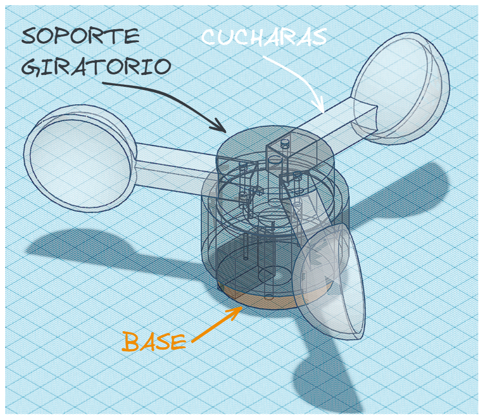
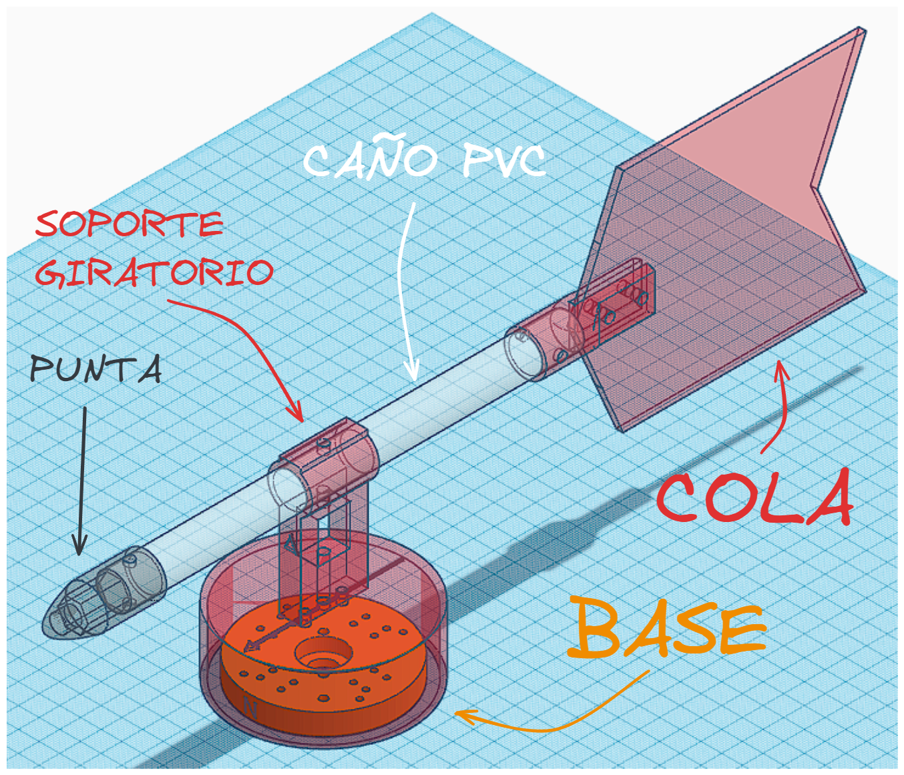
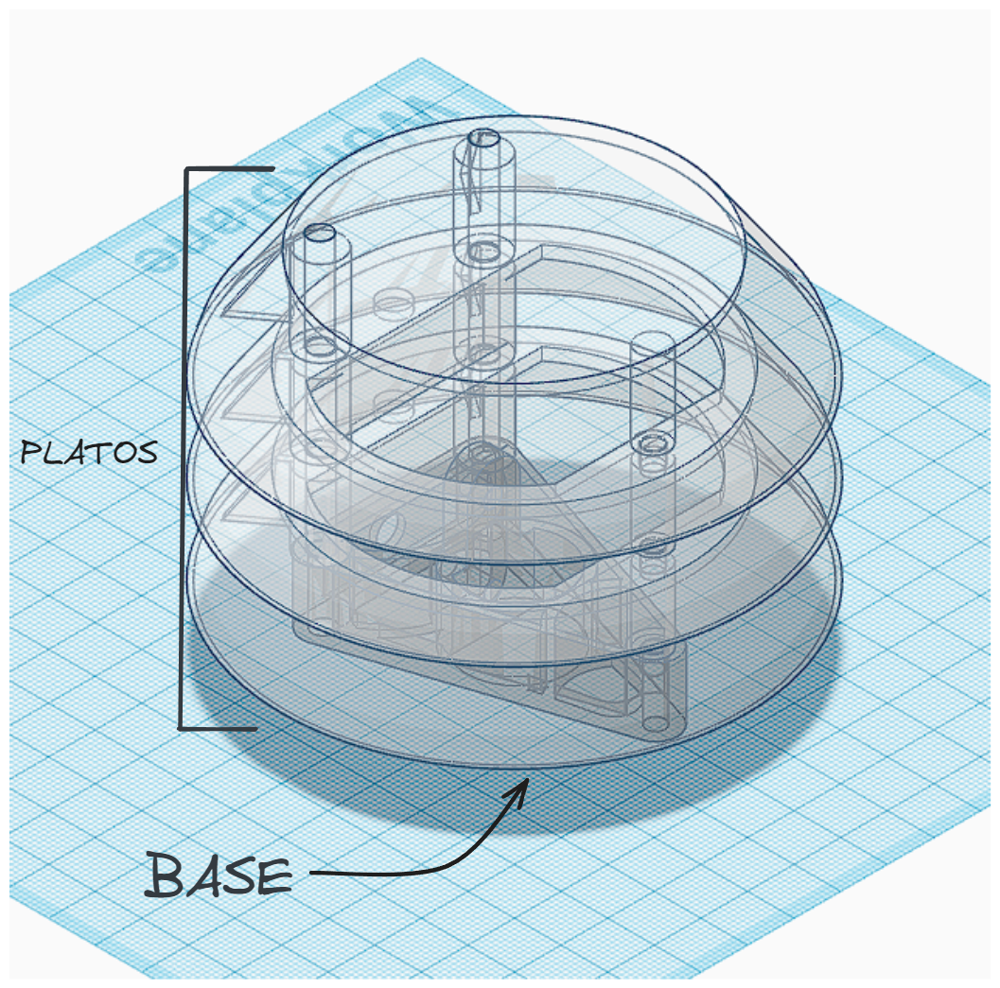

# ESCUELA TÉCNICA N°1 “Otto Krause”
## TALLER DE ELECTRÓNICA
## 5° 1a ELT 2023
## Docentes: 
- Ignacio D'Amore
- Nahuel Maldonado
- Germán Santoandré
## Tutor: 
- Ignacio D'Amore
# Informe: Estacion metereologica | Martin Sanchez || Thomas Acosta 

## Indice
- [Descripcion del proyecto](#Descripcion-del-proyecto)
    - [¿Que es una estación metereologica?](#Que-es-una-estacion-metereologica)
    - [Descripcion de la problematica](#Descripcion-de-la-problematica)
    - [Caracterisiticas del sistema](#Caracterisiticas-del-sistema)
    - [Diagrama de bloques](#Diagrama-de-bloques)
- [Listado de componentes](#Listado-de-componentes)
    - [Microcontrolador](#Microcontrolador)
    - [Sensor Intensidad Luz UV](#Sensor-Intensidad-Luz-UV)
    - [Sensor de humedad y temperatura](#Sensor-de-humedad-y-temperatura)
    - [Sensor de presion atmosferica](#Sensor-de-presion-atmosferica)
    - [Sensor efecto Hall](#Sensor-efecto-Hall)
    - [Adaptador de nivel logico](#Adaptador-de-nivel-logico)
    - [Pantalla OLED](#Pantalla-OLED)
    - [Bateria](#Bateria)
- [Desarrollo teorico y practico](#Desarrollo-teorico-y-practico)
    - [Etapa 1: Investigacion](#Etapa-1-Investigacion)
    - [Etapa 2: Planificacion](#Etapa-2-Planificacion)
    - [Etapa 3: Diagramas](#Etapa-3-Diagramas)
    - [Etapa 4: Prueba de componentes](#Etapa-4-Prueba-de-componentes)
    - [Etapa 5: Prueba de componentes en conjunto + WIFI](#Etapa-5-Prueba-de-componentes-en-conjunto-y-WIFI)
    - [Etapa 6: Diseño e impresion en 3D](#Etapa-6-Diseño-e-impresion-en-3D)
    - [Etapa 7: PCB](#Etapa-7-PCB)
- [Conclusion](#Conclusion)
- [Aclaracion](#Aclaracion)

---
## Descripcion del proyecto

### *¿Que es una estacion metereologica?:

- Una estación meteorológica digital es un dispositivo que recopila y muestra información meteorológica de manera electrónica. Incluye sensores para medir variables como temperatura, humedad, velocidad del viento, dirección del viento, presión atmosférica y precipitación. Estos datos se muestran en una pantalla digital, brindando información actualizada sobre las condiciones meteorológicas locales. Además de permitir la conexión a dispositivos móviles o computadoras para un monitoreo remoto y almacenamiento de datos a largo plazo.


### *Descripcion de la problematica:

- Una pequeña estación meteorológica podría solucionar diversas problemáticas relacionadas con la recopilación de datos climáticos y el monitoreo de las condiciones atmosféricas en una ubicación específica. Algunas de las problemáticas que podría abordar son:

  - Predicción del clima local

  - Alertas tempranas de fenómenos meteorológicos extremos

  - Monitoreo de la calidad del aire

  - Investigación científica local

  - Agricultura y gestión del agua

  - Eficiencia energética

  - Seguridad en el transporte

En resumen, una pequeña estación meteorológica puede solucionar problemáticas relacionadas con la falta de datos climáticos precisos y en tiempo real, y puede tener una amplia gama de aplicaciones en diversas áreas, desde la planificación diaria hasta la toma de decisiones críticas en sectores como la agricultura, la investigación científica y la seguridad.

---

### *Caracterisiticas del sistema:
- La pequeña estación meteorológica está diseñada para recopilar datos básicos sobre las condiciones climáticas en una ubicación específica. A continuación, se presentan algunas características principales de la estación meteorológica:

  - Sensores e instrumentos de medicion

  - Transmisión de datos

  - Registro y almacenamiento de datos en la nube (Formato .CSV)

  - Alimentación energética
  
  - Durabilidad y protección
    
  - Conectividad y compatibilidad


- Existen varias mejoras que se podrían implementar para ampliar su funcionalidad y precisión. Algunas de estas mejoras podrían incluir:

    - Sensores adicionales
      
    - Comunicación mejorada
      
    - Integración con sistemas de automatización

    - Interfaz de usuario avanzada

    - Integración con sistemas de alerta temprana

Estas mejoras podrían hacerla aún más versátil y valiosa para una variedad de aplicaciones, desde la toma de decisiones en la agricultura y la investigación científica hasta el monitoreo ambiental y la planificación urbana.

---


### *Diagrama de bloques:


- Sensores:
  - Temperatura y Humedad: Estas dos variables seran medidas por un mismo sensor en tiempo real. (AHT10)
  - Precipitacion: Para esta variable se usara un sistema en el cual se ira midiendo la precipitacion de a 2ml, el sistema sera parecido a un "sube y baja", y cada vez que se realice un cambio de movimiento, mediante un iman acoplado a la estructura y a un sensor de efecto hall, se iran contando la cantidad de veces que esto sucede. (A3144)
  - Radiacion solar: Este sensor medira el nivel de radiacion uv en tiempo real, en base a esta medicion se mostrara, ademas del valor, la escala correspondiente de raciacion. (Guva-s12s)
  - Direccion del viento: Esta variable sera sensada con una veleta, para saber la posicion de la veleta se probara con sensores de efecto HALL. (Efecto hall: A3144) 
  - Velocidad del viento: Esta variable sera sensada con un anemometro, la velocidad se medira por la cantidad de vueta que se den en un lapso de tiempo, se usara un sensior de efecto hall para saber cuando se dio una vuelta. (A3144)
  - Presion atmosferica: Este sensor medira la presion atmosferica en tiempo real. (BMP280)
 
- Procesamiento y almacenamiento: Todos los datos recibidos por los sensores seran procesados por el microcontrolador ESP32, y opcionalmente guardados en una unidad de almacenamiento. Estos datos seran mostrador por display y una aplicacion y/o pagina web.

- Entrega de datos: La entrega de datos que saldran, una vez procesados por el microcontrolador, seran mostrados por una pequeña pantalla OLED y por una pagina web o aplicacion, en estas dos ultimas se hara uso de la tecnologia WI-FI del micro para que sea posible la transmision de datos de manera inalambrica.


---


## Listado de componentes 
### Microcontrolador
Cabe destacar que esta es la primera vez que en nuestro caso se usa una ESP32 en la realizacion de un proyecto, a diferencia de veces anterior en las que usabamos el ARDUINO UNO 
<div align="center">

 Especificaciones |                       ESP32                     | ARDUINO UNO
:----:            |-------------------------------------------------|---------
 uProcesador      |          Tensilica Xtensa LX6                   |  ATmega328P
Conectividad      |            WIFI & BLUETOOTH                     |-
 Pines            |        38                                       | 32
 Memoria          |  448 KB ROM /  520 KB SRAM                      | 32 Kb Flash / 2Kb SRAM
 Alimentacion     |        5V                                       |   5V 
Tension output    |          3V                                     |   5V
Programacion      |   C (ARDUINO IDE) / Python (MicroPython)        |    C (ARDUINO IDE)
</div>

Diferencias entre arquitectura de 32 bits y 8 bits:

La diferencia principal entre arquitecturas de 32 bits y 8 bits, como la que encuentras en la ESP32 y el Arduino Uno respectivamente, está en la cantidad de datos que pueden procesar en cada ciclo de reloj y en la capacidad de direccionamiento de memoria.

- Procesamiento de Datos:

    - Arduino Uno (8 bits): Puede procesar datos de hasta 8 bits en cada ciclo de reloj. Esto significa que puede manejar números de 0 a 255 directamente en una operación. Operaciones con números más grandes pueden requerir múltiples ciclos de reloj.

    - ESP32 (32 bits): Puede procesar datos de hasta 32 bits en cada ciclo de reloj, lo que permite manejar números mucho más grandes o realizar operaciones más complejas de una vez.

- Capacidad de Direccionamiento de Memoria:

    - Arduino Uno (8 bits): Puede direccionar hasta $2^8=256$ direcciones de memoria diferentes. Esto limita la cantidad de RAM y almacenamiento que puede manejar directamente.

    - ESP32 (32 bits): Puede direccionar hasta $2^{32}$ direcciones de memoria diferentes, lo que le brinda una capacidad mucho mayor para manejar grandes cantidades de datos.

- Complejidad y Funcionalidades:
  
    - Arduino Uno (8 bits): Es más simple y generalmente se utiliza para proyectos más pequeños y tareas más simples. Puede ser más adecuado para proyectos de aficionados o educativos.

    - ESP32 (32 bits): Es más potente y versátil, con capacidades de conectividad Wi-Fi y Bluetooth incorporadas. Es adecuado para proyectos más complejos y avanzados, como aplicaciones IoT (Internet de las cosas).

En resumen, mientras que una arquitectura de 8 bits es suficiente para muchas aplicaciones más simples y proyectos de hobby, una arquitectura de 32 bits como la de la ESP32 ofrece mayor potencia y versatilidad, lo que la hace más adecuada para proyectos más complejos y exigentes. Sin embargo, también puede consumir más energía y ser más costosa. La elección entre ellas dependerá de los requisitos específicos de tu proyecto.


Programacion de la ESP32:


La ESP32 es un microcontrolador que se puede programar en varios lenguajes, y la elección del lenguaje a menudo depende de los requisitos del proyecto y las preferencias del programador. En el desarrollo del proyecto se decidió programar la ESP32 con MicroPython como para poder encarar una alternativa de programacion con la que no se habia trabajado antes. Aquí hay algunas diferencias clave al programar la ESP32 en diferentes lenguajes:

C/C++ con el Entorno de Desarrollo de Arduino:

- Ventajas:
    Amplia comunidad y soporte.
    Fácil integración de bibliotecas y módulos.
    Mucha documentación y tutoriales disponibles.
- Desventajas:
    Mayor consumo de recursos en comparación con lenguajes de más alto nivel.
    Menos abstracciones de hardware en comparación con Python o JavaScript.
  
MicroPython:

- Ventajas:
    Sintaxis de Python, que es fácil de aprender y leer.
    Rápido desarrollo de prototipos y pruebas.
    Interactividad a través del REPL (Read-Eval-Print Loop).
- Desventajas:
    Mayor consumo de recursos que programar en C/C++ directamente.
    Algunas bibliotecas de bajo nivel pueden no estar disponibles o ser diferentes.

    
Nombre: ESP32 - Wi-Fi & Bluetooth MCU


Descripcion: 
ESP32 de 38 Pines es una placa de desarrollo que integra el microcontrolador ESP32-WROOM-32 SMD de Espressif. Esta placa permite controlar todo tipo de sensores, módulos y actuadores mediante WIFI y BLUETOOTH, para proyectos de Internet de las cosas “IoT” de forma eficiente y económica.

Especificaciones:
- Tipo: Módulo Wifi + Bluetooth
- Modelo: ESP32 38 Pines
- Voltaje de Alimentación (USB): 5V DC
- Voltaje de Entradas/Salidas: 3.3V DC
- Consumo de energía de 5μA en modo de suspensión
- CPU principal: Tensilica Xtensa 32-bit LX6
- Frecuencia de Reloj: hasta 240Mhz
- Procesador secundario: Permite hacer operaciones básica en modo de ultra bajo consumo
- Wifi: 802.11 b/g/n/e/i (802.11n @ 2.4 GHz hasta 150 Mbit/s)
- Bluetooth: 4.2 BR/EDR BLE Modo de control dual
- Memoria: 448 KByte ROM, 520 KByte SRAM, 6 KByte SRAM en RTC y QSPI admite múltiples chips flash /
SRAM
- Chip USB-Serial: CP2102
- Antena en PCB
- Pines Digitales GPIO: 24  (Algunos pines solo como entrada)
- Conversor Analógico Digital: Dos ADC de 12bits tipo SAR, soporta mediciones en hasta 18 canales, algunos pines soporta un amplificador con ganancia programable


### Sensor Intensidad Luz UV 

Nombre: Guva-s12s 


Descripcion: 
El módulo sensor de luz ultravioleta GUVA-S12SD se utiliza para detectar la intensidad de la radiación UV. El sensor consta de un fotodiod Schottky que tiene una salida analógica, la corriente generada por el fotodiodo S12SD es convertida por el amplificador SGM8521 en un nivel de tensión proporcional.

Especificaciones:
- Chip: GUVA-S12SD
- Tension de Alimentacion: 2.5V a 5V DC
- Tipo: Analogico
- Bajo consumo
- Alta Estabilidad
- Alta Sensibilidad
- Longitud de Onda Detectada: 240nm a 370nm
- Angulo de Apertura: 130 Grados
- Dimensiones: 11mm x 27mm

Pines:

- VCC: Alimentacion
- GND: Tierra
- SIG: Señal de salida (valores anaogicos entre 0 y 4095)

### Sensor de humedad y temperatura
Nombre: AHT10


Descripcion: 
Este sensor es muy pequeño para facilitar su utilización, ya viene integrado en un módulo que incorpora regulador de voltaje de 3.3V, cambio de nivel lógico que consta de una matriz de resistencias SMD de 10Kx4 (103) y un chip MOSFET de canal N dual de 6 pines y otros componentes SMD para complementar su funcionamiento, también este módulo tiene 4 pines, 2 para su alimentación y 2 para establecer comunicación I2C (Dirección 0x38 predeterminada) con tarjetas de desarrollo como Arduino, NodeMCU, ESP32 y otros microcontroladores.

Especificaciones: 
- Modelo: Módulo AHT10
- Tipo de interfaz: I2C (0x38)
- Voltaje de funcionamiento: 3.3V –  5V
- Rango de medición:
- Temperatura: -40°C a 85°C
- Humedad: 0% a 100% ±2 %RH
- Precisión de temperatura: ±0.3 °C
- Resolución de temperatura: 0.01 °C
- Resolución de humedad: 0.024%
- Precisión de humedad: 2%
- Dimensiones: 15.2mm x 10.6mm
- Peso: 2g


### Sensor de presion atmosferica

Nombre: BMP280


Desscripcion:
El sensor de presión barométrica BMP280 permite medir la altura respecto al nivel del mar, su funcionamiento está basado en la relación entre presión del aire y la altitud. El BMP280  es la evolución del BMP180, posee alta precisión y un bajo consumo de energía. El BMP280 ofrece un rango de medición de 300 a 1100 hPa (Hecto Pascal). Basado en tecnología BOSCH piezo-resistiva con gran robustez EMC, alta precisión y linealidad, así como con estabilidad a largo plazo. Se ha diseñado para ser conectado directamente a un microcontrolador a través de I2C o SPI. El sensor BMP280 presenta diversas mejoras respecto al sensor BMP180 como: Mejor resolución de presión y temperatura, mejor precisión, mejores filtros digitales y un menor consumo de energía.

Especificaciones:
- Voltaje de Operación: 1.8V - 3.3V DC
- Interfaz de comunicación: I2C o SPI (3.3V)
- Rango de Presión: 300 a 1100 hPa
- Resolución: 0.16 Pa
- Precisión absoluta: 1 hPa
- Rango de Temperatura: -40°C a 85°C
- Resolución de temperatura: 0.01°C
- Precisión Temperatura: 1°C
- Precisión de HR: +-3%
- Ultra-bajo consumo de energía
- Completamente calibrado
- Frecuencia de Muestreo: 157 Hz (máx.)
### Sensor efecto Hall

Nombre: A3144


Descripcion:
Sensor de efecto hall con salida digital y retención de estado. Cambia de cero a uno ante la presencia de un campo electromagnetico. En estado de reposo la salida del sensor se encuentra en nivel "Alto" y ante la presencia de un campo electromagnetico la salida pasa a nivel "Bajo".

Pines:
- Pin izquierda, VCC: Alimentacion
- Pin centro, GND: Tierra
- Pin derecha, Signal: salida de señal digital (1 o 0)

Especificaciones:
- Voltaje de Operacion: 4.5V A 25V
- Voltaje de Operacion Tipico: 5V
- Corriente Maxima: 25mA
- Puede Detectar ambos polos de un iman
- Voltaje de salida igual al voltaje de entrada
- Proteccion de polaridad inversa
- Rango de temperatura:-40°C a 85°C
  
### Adaptador de nivel logico 

Nombre: CJMCU 0108


Descripcion:
Convertidor de nivel lógico bidireccional, puede realizar una conexión entre dispositivos que operan a diferentes tensiones. Funciona con configuraciones de drenaje abierto y push-pull. Este traductor de 8 bits utiliza dos rieles de fuente de alimentación configurables separados. El puerto A rastrea la tension de suministro del pin VA (VCCA). El pin VA acepta cualquier tension de suministro entre 1,2 V y 3,6 V. El puerto B rastrea la tension de suministro del pin VB (VCCB). El pin VB acepta cualquier tension de suministro entre 1,65 V y 5,5 V.

Especificaciones:
- Chip: TXS0108E
- Canal: 8 canales
- Tension de soporte del terminal VCCA: 1,2 V-3,6 V
- Tension de soporte del terminal VCCB: 1,65 V-5,5 V
- Velocidad máxima de transferencia para push-pull: 110 Mbps
- Velocidad máxima de transferencia para drenaje abierto: 1,2 Mbps
- Número de pines: 20 pines
- Tamaño: 26 mm x 16 mm x 3 mm

Pines: 

- Va: Acepta cualquier tension de suministro entre 1,2 V y 3,6 V, la cual va a tener toda la linea de pines "a"
- Vb: Acepta cualquier tension de suministro entre 1,65 V y 5,5 V., la cual va a tener toda la linea de pines "b"
- GND: Tierra
- Ax/Bx: Son los 8 canales I/O, se acomodan por pares con los numeros (A1, B1; A2, B2;...)
- OE: Out Enable, habilita las salidas del modulo.

### Pantalla OLED

Nombre: SSH1106


Descripcion:
Esta pantalla es muy pequeña (1,3 pulgadas de diagonal) pero muy visible dado su alto contraste OLED. Es una pantalla con una matriz de un color de 128x64 puntos. Dado que la pantalla está basada en la tecnología LED, no necesita retroiluminación y tiene un alto contraste incluso a plena luz del día.
El driver interno es un SH1106 que se comunica por I2C, un protocolo muy rápido ideal apra éste tipo de pantallas. Internamente todo el conjunto funciona a 3,3V pero se han acoplado tanto la alimentación como los pines de entrada para funcionar perfectamente a 5V lo que lo hace ideal para utilizar con nuestro microcontrolador favorito de 5V

Especificaciones:
- Pantalla OLED de alto contraste
- Color Emision: Azul
- Resolución: 128x64 píxeles
- Controlador Interno: SH1106
- Interfaz I2C
- Angulo de visión: >160º
- Alimentación: 3 a 5V DC
- Consumo con todos sus pixeles encendidos: 80mA
- Dimesiones: 35mm x 25mm
- Dimensiones PCB: 35.5mm x 33.7mm
- Peso: 6g
- Orden de Pines: GND,VCC
- Temepratura de funcionamiento: -30 a +70 ºC
### Bateria

Nombre: Power bank 5000 mAh


Caracteristicas:
El power bank básicamente es una batería de litio controlado por un microchip, de manera que detecta el dispositivo conectado y le suministra la corriente necesaria que admite dicho dispositivo. Dispone de circuitos de protección contra sobreintensidad y cortocircuito de manera que no tendremos que preocuparnos por si el dispositivo sufrirá daños. No obstante, se recomienda utilizar modelos certificados por el organismo de control pertinente.
El power bank cuenta como mínimo con un puerto de entrada microUSB que se utiliza para recargar el powerbank. Algunos power bank cuentan con placas solares integradas, para recargar sus baterías.
Posee al menos una salida USB para alimentar los dispositivos móviles que deseemos recargar. Puede disponer de más de una salida USB permitiendo la recarga simultánea de varios dispositivos.
- Entrada: 5V micro USB
- Salida micro USB 5V 1A
- Capacidad: 5000mAh.
- Leds indicadores.

## Desarrollo teorico y practico:

### Etapa 1: Investigacion:
Descripcion:
Durante esta etapa nos dedicamoa a la investigacion y busqueda de algunas estaciones metereologicas, entre ellas vimos propuestas de escala industrial, proyectos escolares y proyectos caseros. Durante este proceso obtuvimos informacion sobre microcontroladores, sensores, tecnologias en la nube, lenguajes de programacion, etc. En este proceso tomamos decisiones sobre gran cantidad de componentes y tecnologias que ibamos a usar durante el proyecto.

### Etapa 2: Planificacion:
Descripcion:
Durante esta etapa visualizamos las tareas a realizar y nos las repartimos, ademas de plantear diagramas generales sobre la composicion del proyecto para tener dimensionado como iban a ir las piezas del mismo.

Diagrama de Gantt que usamos para reparticion de tareas:


Diagrama de bloques sobre el proyecto:


### Etapa 3: Diagramas:
Descripcion:
Durante esta etapa realizamos los diagramas electricos en KiCad (sch) con fuente de alimentacon, sensores, pantalla y microcontrolador. Esto lo hicimos con el fin de poder tener un soporte a la hora de armar circuitos para probarlos.


### Etapa 4: Prueba de componentes:

Descripcion:
En esta etapa realizamos prueba de todos los componentes por separado para ver el funcionamiento de cada uno para leugo poder juntarlos en un solo codigo. Probamos todos los sensores, la pantalla y la comunicacion Wifi con la nube para poder enviar datos.

Cabe destacar la explicacion de el I2C, ya que dicho protocolo de comunicacion fue usado en varios de nuestros sensores, como por ejemplo el BMP280, AHT10 y la pantalla OLED SSH1106.

I2C

Que significa "Inter-Integrated Circuit" o "Inter-IC", es un protocolo de comunicación serial que permite la transferencia de datos entre varios dispositivos electrónicos utilizando solo dos cables: uno para la transmisión de datos (SDA) y otro para la sincronización de reloj (SCL).
Aquí hay algunos conceptos clave sobre I2C:

1. Dispositivos Maestro y Esclavo: En un bus I2C, hay al menos un dispositivo maestro y uno o más dispositivos esclavos. El maestro inicia y controla la comunicación, mientras que los esclavos responden a las solicitudes del maestro.

2. SDA (Serial Data Line): Este cable transporta los datos entre los dispositivos. Toda la información, ya sea de lectura o escritura, fluye a través de este canal.

3. SCL (Serial Clock Line): Este cable lleva la señal de reloj que sincroniza la transmisión de datos entre los dispositivos. La velocidad de transferencia de datos está determinada por la frecuencia de esta señal.

4. Direcciones de Dispositivos: Cada dispositivo esclavo en un bus I2C tiene una dirección única de 7 bits (aunque puede extenderse a 10 bits en algunas variantes). El maestro utiliza esta dirección para seleccionar el dispositivo con el que desea comunicarse.

5. Inicio y Detención de la Comunicación: Antes de que la comunicación comience, el maestro envía una secuencia de inicio (start) en la que el nivel de SDA se baja mientras SCL está alto. Al final de la comunicación, se envía una secuencia de detención (stop), donde SDA sube mientras SCL está alto.

6. Transferencia de Datos: La transferencia de datos en I2C sigue el formato de marco de datos. Cada bit es transmitido mientras SCL está en un estado específico (alto o bajo). La transmisión de 8 bits generalmente se sigue de un bit de ACK/NACK (acknowledge/no acknowledge) enviado por el dispositivo receptor.

I2C se utiliza comúnmente en sistemas embebidos, sensores, módulos de memoria, y otros dispositivos donde es crucial tener una interfaz de comunicación eficiente y de bajo costo. La simplicidad y la capacidad de conectar múltiples dispositivos en el mismo bus son algunas de las razones por las que I2C es tan popular en la electrónica.

Codigos de prueba:

AHT10:
```python
import utime
from machine import Pin, I2C
import ahtx0

# I2C for the sensor
i2c = I2C(scl=Pin(22), sda=Pin(21))

# Create the sensor object using I2C
sensor = ahtx0.AHT10(i2c)

while True:
    print("\nTemperature: %0.2f C" % sensor.temperature)
    print("Humidity: %0.2f %%" % sensor.relative_humidity)
    utime.sleep(5)
```

BMP280:
```python
from machine import Pin, I2C
from time import sleep
import BME280
# I2C for the sensor
i2c = I2C(scl=Pin(22), sda=Pin(21), freq=10000)

while True:
  bme = BME280.BME280(i2c=i2c)
  temp = bme.temperature
  pres = bme.pressure
  print('Temperature: ', temp)
  print('Pressure: ', pres)
  sleep(5)
```
GUVA S12SD:
```python
import machine
import time

sensor_pin = machine.Pin(36) 

# Inicializa el ADC
adc = machine.ADC(sensor_pin)

# Funcion para leer la intensidad UV
def read_uv_intensity():
    uv_values = []
    for _ in range(10):  # Toma 10 datos y los promedia
        uv_values.append(adc.read())
        time.sleep_ms(10)  
    return sum(uv_values) / len(uv_values)  # Devuelve el promedio

while True:
    uv_value = read_uv_intensity()
    voltage = uv_value/4095*3.3 # pasar de lectura del sensor a salida de tension
    voltage_mV= voltage*1000 # pasaje de V a mV
    print("UV Intensity:", uv_value)
    print("V:", voltage)
    time.sleep(1)  
    # definicion de escalas UV en base a salida de tension del sensor
    if(voltage_mV<50):
        print("UV_SCALE: 0")
    elif(voltage_mV>=50 and voltage_mV<227):
        print("UV_SCALE: 1")
    elif(voltage_mV>=227 and voltage_mV<318):
        print("UV_SCALE: 2")
    elif(voltage_mV>=318 and voltage_mV<408):
        print("UV_SCALE: 3")
    elif(voltage_mV>=408 and voltage_mV<503):
        print("UV_SCALE: 4")
    elif(voltage_mV>=503 and voltage_mV<606):
        print("UV_SCALE: 5")
    elif(voltage_mV>=606 and voltage_mV<696):
        print("UV_SCALE: 6")
    elif(voltage_mV>=696 and voltage_mV<795):
        print("UV_SCALE: 7")
    elif(voltage_mV>=795 and voltage_mV<881):
        print("UV_SCALE: 8")
    elif(voltage_mV>=881 and voltage_mV<976):
        print("UV_SCALE: 9")
    elif(voltage_mV>=976 and voltage_mV<1079):
        print("UV_SCALE: 10")
    elif(voltage_mV>=1079):
        print("UV_SCALE: 11")
```
OLED:
```python
from machine import Pin, I2C
from sh1106 import SH1106_I2C
import freesans20
from writer_minimal import Writer
from machine import RTC 
from time import sleep_ms

i2c = I2C(scl=Pin(22), sda=Pin(21), freq=400000) 
oled = SH1106_I2C(128, 64, i2c, None, addr=0x3C)
font_writer = Writer(oled, freesans20)

rtc = RTC() 
rtc.datetime((2023, 8, 31, 4, 10, 54, 0, 0)) 
# rtc.datetime((YYYY, MM, DD, WD, HH, MM, SS, MS)) 
# WD 1 = Monday 
# WD 7 = Sunday 
isPoint = True

while True: 
    t = rtc.datetime() 
    oled.fill(0) 
    oled.text('** 1.3 OLED **', 10, 0) 
    # Display the date
    font_writer.set_textpos(20, 15)
    font_writer.printstring('{}-{:02d}-{:02d}' .format(t[0],t[1],t[2]))
    if isPoint: 
        colon = ':' 
    else: 
        colon = ' '
    # Display the time
    font_writer.set_textpos(40, 40)
    font_writer.printstring('{:02d}{}{:02d}' .format(t[4], colon, t[5]))
    oled.show() 
    sleep_ms(500) 
    isPoint = not isPoint
```
VELETA:
```python
import machine
import utime

sensor_norte = machine.Pin(25, machine.Pin.IN)
sensor_sur = machine.Pin(26, machine.Pin.IN)
sensor_este = machine.Pin(27, machine.Pin.IN)
sensor_oeste = machine.Pin(14, machine.Pin.IN)

while True:
    norte = sensor_norte.value()
    sur = sensor_sur.value()
    este = sensor_este.value()
    oeste = sensor_oeste.value()
    if norte and este:
        print("Noreste")
    elif norte and oeste:
        print("Noroeste")
    elif sur and este:
        print("Sureste")
    elif sur and oeste:
        print("Suroeste")
    elif norte:
        print("Norte")
    elif sur:
        print("Sur")
    elif este:
        print("Este")
    elif oeste:
        print("Oeste")
    utime.sleep(0.1)  # Pequeña pausa para evitar repeticiones rápidas
```
ANEMOMETRO:
```python
from machine import Pin
import utime
import math

# Configura el pin del sensor de efecto Hall
hall_sensor_pin = Pin(14, Pin.IN)

# Inicializa variables
last_time = None  # Inicializa la variable para el primer toque

def button_handler(pin):
    global last_time
    current_time = utime.ticks_ms()  # Registra la marca de tiempo actual
    if last_time is not None:
        interval = (current_time - last_time) / 1000  # Calcula el intervalo entre toques
        print("Intervalo entre toques (s):", interval)

        # Calcula la velocidad angular en radianes por segundo
        velocidad_angular_rad_s = 2 * math.pi / interval
        velocidad_km = (0.023 * velocidad_angular_rad_s) * 3.6 # pasa de rad/s a km/h
        print("Velocidad (km/h):", velocidad_km)

    last_time = current_time  # Actualiza la marca de tiempo

try:
    button_pin = Pin(14, Pin.IN) 
    button_pin.irq(trigger=Pin.IRQ_FALLING, handler=button_handler)

    # Bucle principal
    while True:
        pass
```
PLUVIOMETRO:
```python
import machine

# Declaración de variables
mmPerPulse = 0.173
mmTotal = 0

# Función de manejo de interrupción
def handle_interrupt(pin):
    global mmTotal
    mmTotal += mmPerPulse
    print(mmTotal, "mm")

# Configurar el pin del sensor como entrada para la interrupción
sensor = machine.Pin(14, machine.Pin.IN)

# Configurar la interrupción en el flanco de subida del pin
sensor.irq(trigger=machine.Pin.IRQ_RISING | machine.Pin.IRQ_FALLING, handler=handle_interrupt)

# Bucle principal
while True:
    pass
```

### Etapa 5: Prueba de componentes en conjunto y WIFI

Al llegar a esta etapa ya tenemos a todos los componentes funcionando por individual con sus respectivos codigos, en esta etapa nos encargamos de juntar todo en un mismo codigo, haciendo que puedan darse la recopilacion de datos y que los mismos se puedan mostrar en la pantalla OLED, luego nos encargamos de poder enviarlo mediante conexion WIFI a un servidor en la nube, como servicio en la nube usamos Thingspeak, este servicio nos permite mandar los datos de forma facil y rapido, ademas de poder verlos en "tiempo real" desde su pagina web, la unica limitacion del servicio es que el intervalo entre recepcion de datos al server es de 15s, el mismo puede ser en tiempo real al pagar un adicional.

```python
import machine, network, time, urequests
from machine import Pin, I2C
from sh1106 import SH1106_I2C
import ahtx0
import BME280
import machine
import utime
import math

ssid = 'BA Escuela'
password = ''
url = "https://api.thingspeak.com/update?api_key=06BZMYMBYQIQ02XG"

red = network.WLAN(network.STA_IF)

red.active(True)
red.connect(ssid, password)

while red.isconnected() == False:
  pass

print('Conexión correcta')
print(red.ifconfig())

ultima_peticion = 0
intervalo_peticiones = 1

i2c = I2C(scl=Pin(22), sda=Pin(21), freq=400000)  # Configura el bus I2C en los mismos pines para ambos dispositivos.


sensor_pin = machine.Pin(36) 
# Initialize the ADC
adc = machine.ADC(sensor_pin)
# Configura el display OLED
oled = SH1106_I2C(128, 64, i2c)

# Direcciones I2C de los dispositivos
sensor_address = 0x38
oled_address=0x3C
BME280_I2CADDR = 0x76

hall_sensor_pin = Pin(14, Pin.IN)
last_time = None

def button_handler(pin):
    global last_time
    current_time = utime.ticks_ms()  # Registra la marca de tiempo actual
    if last_time is not None:
        interval = (current_time - last_time) / 1000  # Calcula el intervalo entre toques
        velocidad_angular_rad_s = 2 * math.pi / interval
        velocidad_km = (0.023 * velocidad_angular_rad_s) * 3.6
        last_time = current_time  # Actualiza la marca de tiempo
    return velocidad_km
    
def read_uv_intensity():
    uv_values = []
    for _ in range(10):  # Take 10 readings and average them
        uv_values.append(adc.read())
        time.sleep_ms(10)  # Wait for 10 milliseconds between readings
    return sum(uv_values) / len(uv_values)  # Return the average

def Escala_UV(voltage_mV):
    if(voltage_mV<50):
        Escala = 0
    elif(voltage_mV>=50 and voltage_mV<227):
        Escala = 1
    elif(voltage_mV>=227 and voltage_mV<318):
        Escala = 2
    elif(voltage_mV>=318 and voltage_mV<408):
        Escala = 3
    elif(voltage_mV>=408 and voltage_mV<503):
        Escala = 4
    elif(voltage_mV>=503 and voltage_mV<606):
        Escala = 5
    elif(voltage_mV>=606 and voltage_mV<696):
        Escala = 6
    elif(voltage_mV>=696 and voltage_mV<795):
        Escala = 7
    elif(voltage_mV>=795 and voltage_mV<881):
        Escala = 8
    elif(voltage_mV>=881 and voltage_mV<976):
        Escala = 9
    elif(voltage_mV>=976 and voltage_mV<1079):
        Escala = 10
    elif(voltage_mV>=1079):
        Escala = 11
    return Escala

def reconectar():
    print('Fallo de conexión. Reconectando...')
    time.sleep(10)
    machine.reset()

while True:
    uv_value = read_uv_intensity()
    voltage = uv_value/4095*3.3
    voltage_mV= voltage*1000
    # Leer datos del sensor (por ejemplo, 4 bytes)
    data_received_sensor = bytearray(4)
    data_received_bme = bytearray(4)
    # Configura la dirección I2C para el sensor

    i2c.readfrom_into(sensor_address, data_received_sensor)
    i2c.readfrom_into(BME280_I2CADDR, data_received_bme)
    # Procesa los datos recibidos según la hoja de datos del sensor
    # Supongamos que los datos son una temperatura en grados Celsius
    sensor = ahtx0.AHT10(i2c)
    bme = BME280.BME280(i2c=i2c)
    # Borra el contenido anterior del display
    oled.fill(0)
    

    # Muestra los datos del sensor en el display OLED
    mensaje_t = "Temp: {:.2f} C".format(sensor.temperature)
    oled.text(mensaje_t, 0, 0)
    mensaje_h = "Humidity: {:.1f} %".format(sensor.relative_humidity)
    oled.text(mensaje_h, 0, 10)
    mensaje_p = "Pres: {:.6s} hPa".format(bme.pressure)
    oled.text(mensaje_p, 0, 20)
    mensaje_UV = "UV: {:.0f} ".format(uv_value)
    oled.text(mensaje_UV, 0, 30)
    mensaje_Escala_UV = "Escala UV: {:.0f} ".format(Escala_UV(voltage_mV))
    oled.text(mensaje_Escala_UV, 0, 40)
    mensaje_vel = "Velocidad: {:.0f} km".format(button_handler(pin))
    oled.text(mensaje_vel, 0, 50)

    # Actualiza el display
    oled.show()
    try:
        if (time.time() - ultima_peticion) > intervalo_peticiones:
            respuesta = urequests.get(url + "&field1=" + str(sensor.temperature) + "&field2=" + str(sensor.relative_humidity) + "&field3=" + str(bme.pressure) + "&field4=" + str(uv_value) + "&field5=" + str(Escala_UV(voltage_mV)))
            print ("Respuesta: " + str(respuesta.status_code))
            respuesta.close ()
            ultima_peticion = time.time()
    except OSError as e:
        reconectar()
    try:
        button_pin = Pin(14, Pin.IN)  # Assuming you have a button connected to Pin 0
        button_pin.irq(trigger=Pin.IRQ_FALLING, handler=button_handler)


    except KeyboardInterrupt:
        button_pin.irq(handler=None)  # Detiene la interrupción al salir del programa
        print("Programa detenido")
```

### Plataforma de muestra de datos:


ThingSpeak es una API y aplicación de código abierto para el Internet de las Cosas que permite almacenar y recopilar datos de objetos conectados a través del protocolo HTTP a través de Internet o de una red local.

Con ThingSpeak, el usuario puede crear aplicaciones de registro de datos de sensores, aplicaciones de seguimiento de ubicación y una red social para los objetos conectados, con actualizaciones de estado.


### Etapa 6: Diseño e impresion en 3D

En esta etapa procedimos por diseñar e imprimir todo lo necesisario para poder crear todo lo necesario para poder poder hacer los instrumentos que miden velocidad del viento (Anemometro), direccion del viento (Veleta), precipitacion (Pluviometro), ademas hicimos la Stevenson Screen que sirve para poder proteger a el sensor de luz UV y el sensor de humedad y temperatura de la lluvia, suciedad, hojas, etc.

A continuacion explicaremos los diseños y como funcionan:
- Anemometro:
  El anemometro tiene un sensor de efecto hall acoplado a la parte superior de la base, insertado en un cabidad diseñada para el mismo, ademas tiene un iman acoplado al techo interno de el soporte giratorio a una distancia de ~2cm del centro. El anemometro mide la velocidad del viento a partir de la velocidad de el soporte giratorio, esto lo sabemos gracias a que medimos el intervalo de tiempo entre pasadas de el iman frente al sensor mientras que el soporte giratorio gira.



- Veleta:
  La veleta sirve para medir hacia que direccion apunta el viento, esto lo hacemos poniendo 4 sensores de efecto hall en la parte superior de la base, los mismos los ponemos apuntando hacia los 4 principales puntos cardinales (Norte, Sur , Este y Oeste), ademas ponemos un iman en el techo interior de el soporte giratorio. Para medir la direccion de el viento hacemos lo siguiente, a medida de que el soporte rota, iman se va a posicionar sobre un sensor o entre dos, de esta manera cada vez que el iman esté solamento sobre uno de los sensores va a marcar uno de los 4 principales puntos cardinales y cuando el iman esté entre dos sensores va a marcar uno de los 4 puntos cardinales intermedios (Noreste, Sureste, Suroeste y Noroeste).



- Pluviometro:
   El pluviometro ira midiendo la precipitacion de a 1.73ml, el sistema sera parecido a un "sube y baja", la lluvia que caiga sobre el embudo bajara hacia el "sube y baja" y cada vez que se realice un cambio de movimiento, mediante un iman acoplado a la estructura ("Sube y baja") y a un sensor de efecto hall acoplado a una de las paredes internas de la base, se iran contando la cantidad de veces que esto suceda, de manera que para obtener la cantidad de lluvia caida se multiplicaran la (cantidad de veces que el iman paso frente a sensor) * (1,73). 


- Stevenson screen:
  La stenvenson screen nos servira para poder proteger el sensor UV y el sensor de humedad y temperatura de la lluvia, polvo, hojas, ademas de otras variables de el entorno que puedan ser contrarestantes para el optimo funcionamiento de dichos sensores. Ambos sensores iran dentro de la Stevenson screen (ya que los platos son circunferecia con hueco en el centro) y acoplados a la base.



### Etapa 7: PCB:
En esta etapa se hizo el diseño del PCB ya que se sabia con claridad como iba a ir todo organizado en el circuito, ya que se fue haciendo retoques a lo largo del proyecto y se decidio hacer esto por ultimo para no se tenga que hacer PCB's a medida de que se aplican cambios.


# Conclusion:

El proyecto es interesante para poder aprender principalmente sobre la comunicacion WIFI de datos, ya que la recopilacion de los mismos no es muy dificil gracias a las librerias proveidas por los fabricantes. A lo largo de este proyecto se pudo aplicar saberes previos que se tenian sobre electronica y programacion, pero ademas se aprendió cosas nuevas como por ejemplo el uso de microPython, ya que se decidió programar nuestra ESP32 con ese lenguaje para aprender algo nuevo adeamas de el C++ de Arduino, el uso del protocolo I2C, el uso de el wifi en ESP, uso de servicios en la nube como Thinkspeak, uso de nuevos sensores, entre otras cosas.


# Aclaracion
## El proyecto al 10/11 (dia de publicacion de informe y presentacion) aun no está al 100%, nos quedarias por terminar las siguentes cosas:
- Creacion del PCB en fisico
- Cambiar a sensores de efecto hall unipolares para la veleta
- Crear estructura que soporte a toda la estacion metereologica, elementos de medicion y caja en la que ira el microcontrolador-SHIELD, powerbank y OLED
- Diseñar y crear caja en la que ira el microcontrolador-SHIELD, powerbank y OLED
- Ajustes en el wifi (codigo)
